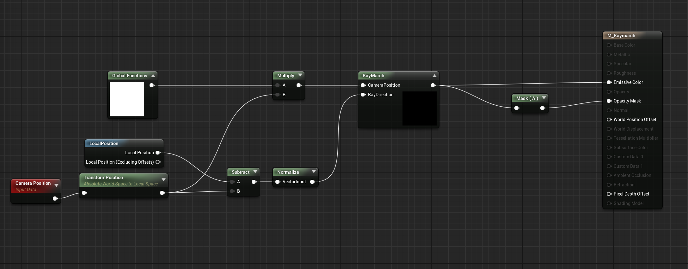

Raymarching is a fascinating rendering technique, and is useful for rendering a wide variety of effects. However, it is not particularly easy to implement raymarching in Unreal Engine, since it does not provide easy access to a shader scripting language, instead you have to create shaders using the visual material editor. However, there is a node that allows you to enter custom HLSL code though, which we will be taking advantage of.

I am not going to explain raymarching in-depth, so if you want to learn more this [Video by Sebastian Lague](https://www.youtube.com/watch?v=Cp5WWtMoeKg) explains it well, and this [article by Jamie Wong](http://jamie-wong.com/2016/07/15/ray-marching-signed-distance-functions/) offers some easy to understand shader examples.

We will be placing our raymarching shader onto a cube, so that it can be placed and viewed in the scene. This method was adapted from this [video by Art of Code](https://www.youtube.com/watch?v=S8AWd66hoCo), which uses the same method and implements it in Unity.

## Setting up the material

First we need to create a material where we can write our raymarching code. You should set the material to be a Surface material that is Masked, Unlit, and Two Sided. It should be Unlit since we will be calculating our own lighting, and it should be Two-Sided, so that we can still see our raymarched surface even when we are inside the bounds of the mesh.

To begin we will start writing our raymarching functions in a custom shader node. To be able to write functions in the custom node requires a bit of a hack, which results in some strange looking code, if you want an explanation of why you write it this way check out this [article](https://bebylon.dev/ue4guide/graphics-development/shader-development/tips-tricks/), but essentially each custom node is its own HLSL function, so we want to escape from that function, so that we can write our own new functions.

We will write all our raymarching and signed-distance functions in global node that we can use later. First we will write the raymarch function which takes in the camera position and the view direction towards the current pixel and returns the distance to the current point from the camera.

This is my recommended node setup:



`Global Functions` and `RayMarch` are both custom shader nodes that you will have to implement. To gain access to our `Global Functions` in other nodes we have to use its output, so we can just multiply it with any other node to make its functions accessible.

To start writing HLSL functions add the following to your `Global Functions` custom node:

```c
// this escapes from the current HLSL function and allows us to write our own functions
	return 1;
}

float raymarch( float3 camPos, float3 rayDir) {
    // raymarching code goes here

// note the lack of closing bracket on the final function
```

I recommend you write your HLSL in a separate text editor and then paste it into Unreal, since it can be cumbersome to write code in the text box.

Now we can actually write the raymarcher:

```c
// Parameters: Camera Position and Ray Direction
// Output: Distance to closest surface along ray
float raymarch( float3 camPos, float3 rayDir ) {
    float depth = 0;

    for ( int i = 0; i < MAX_STEPS; i++ ) {
      	// Calculate next position along view ray
        float3 pos = camPos + ( rayDir * depth );

        // Calcualte shortest distance to scene at position
        float dist = sceneSDF( pos );

        depth += dist;
      	// finish when very close to a surface or when ray has travelled to far
        if ( dist <= EPSILON || depth > MAX_DIST ) {
            break;
        }
    }
    return depth;
// remember to leave out the final bracket!
```

You can define `MAX_DIST`, `MAX_STEPS`, and `EPSILON` with:

```c
#define MAX_DIST 10000.0
#define MAX_STEPS 100
#define EPSILON 0.0001

float raymarch( float3 camPos, float3 rayDir ) {
 	...
```

Now we need a `sceneSDF` function, so that we can calculate the distance to the surface at any point. The simplest SDF is sphere, so we can use that to start

```c
float sceneSDF( float3 pos ) {
 	return length(pos) - 40.0;
}

float raymarch(...) {
  ...
```

Now we can finally render something, although it won't look too impressive yet. First we need to add another custom HLSL node to the material graph, so that we can actually run the calculations. This node should output a `CMOT Float 4` and should take two inputs: `CameraPosition` and `RayDirection`

```c
float depth = raymarch( CameraPosition, RayDirection );

// if no surface was hit then return black
if (depth >= MAX_DIST) {
  return float4( 0.0, 0.0, 0.0, 0.0 );
}

// otherwise return white
return float4( 1.0, 1.0, 1.0, 1.0 );
```

Send the output of this new node to `Emissive Color` and then mask out the alpha channel and send that to `Opacity Mask` If you've done everything correctly so far you should see a white circle in the middle of any mesh that you apply the material to. The circle is actually a sphere, but it doesn't have any shading yet, so it doesn't look like much.

## Calculating Normals

To shade the sphere properly we need to get the normals of the sphere, we could do this mathematically, but a more robust method is to estimate them by sampling the SDF.

Add the following function to the `Global Functions` custom node

```c
float3 estimateNormals(float3 pos) {
  return normalize( float3(
  	sceneSDF(float3( pos.x + EPSILON, pos.yz ) ) 
    - sceneSDF(float3( pos.x - EPSILON, pos.yz) ),
    sceneSDF( float3( pos.x, pos.y + EPSILON, pos.z) )
    - sceneSDF( float3( pos.x, pos.y - EPSILON, pos.z ) ),
    sceneSDF( float3(pos.xy, pos.z + EPSILON) ) 
    - sceneSDF( float3( pos.xy, pos.z -EPSILON ) )
  ));
}
```

Now we can use this function to estimate the normal of a surface at any point. To use this we can add it to our final color calculation.

```c
if (depth >= MAX_STEPS) {
  return float4( 0.0, 0.0, 0.0, 0.0 );
}

// visualize the estimated normals
float3 normal = estimateNormals( CameraPosition + (RayDirection * depth));
return float4( normal, 1.0 );
```

You should get the following:


Now the material should look more like a sphere, since it should be displaying the surface normals as colors. However, it still doesn't really look like a real object, since it has no lighting.

## Phong Shading

We want our object to look like a real, lit object, so we are going to use Phong shading, since it is fairly simple to implement. Now that we have the surface normals we can use them to calculate how much light would hit each part of the surface. We are going to implement a simple directional light, but you could add point or spot lights with the same method.

First we need a direction vector for our light

```c
float3 lightDir = normalize( float3( -0.3, -1.0, -0.3 ));

// estimate surface normal
float3 normal = estimateNormals( CameraPosition + RayDirection* depth);

// the diffuse color of the surface
float3 diffuseColor = float3( 0.8, 0.2, 0.0 );

// calculate the specular reflection
float diffuseLight = clamp( dot( -lightDir, normal ), 0, 1 );

float3 result = ( diffuseLight * diffuseColor ) ;
return float4(result, 1.0);
```

You should now have a sphere that appears to be lit by a directional light. We can now also add specular reflections and ambient lighting.

```c
float3 lightDir = normalize( float3( -0.3, -1.0, -0.3 ));

float3 normal = estimateNormals( CameraPosition + RayDirection* depth);

// the diffuse color of the surface
float3 diffuseColor = float3( 0.8, 0.2, 0.0 );

// calculate the diffuse lighting
float diffuseLight = clamp( dot( -lightDir, normal ), 0, 1 );

// amount of ambient light applied to entire surface
float ambientLight = 0.2;

// calculate specular reflections
float3 reflectDir = reflect( -lightDir, normal );
float specular = pow( clamp( dot( reflectDir, RayDirection ), 0.0, 1.0 ), 16.0 );


float3 result = (diffuseLight + ambientLight) * diffuseColor + specular;
return float4(result, 1.0);
```

You should now have a nice shiny sphere, like so:


Now that we have a functional raymarcher we should take advantage of it. We can do a lot more than render a sphere. For starters let's blend between two different shapes. You can find the SDFs for more shapes on [Inigo Quilez's website](https://www.iquilezles.org/www/articles/distfunctions/distfunctions.htm). I am using a sphere and a bounding box. Add these functions to your global custom node and then you can blend between them in your scene SDF.

```c
float boundingBoxSDF( float3 p, float3 b, float e ) {
   p = abs(p)-b;
  float3 q = abs(p+e)-e;
  return min(min(
      length(max(float3(p.x,q.y,q.z),0.0))+min(max(p.x,max(q.y,q.z)),0.0),
      length(max(float3(q.x,p.y,q.z),0.0))+min(max(q.x,max(p.y,q.z)),0.0)),
      length(max(float3(q.x,q.y,p.z),0.0))+min(max(q.x,max(q.y,p.z)),0.0));
}
float sphereSDF( float3 pos, float radius) {
	return length(pos) - radius;
}
float sceneSDF( float3 pos ) {
  float sphere = sphereSDF(pos, 40.0);
  float box = boundingBoxSDF(pos, float3( 30.0, 30.0, 30.0 ), 5.0);
  return lerp( sphere, box, 0.5 + sin(View.GameTime)/2 );
}
```

Now your shape will blend back and forth between a sphere and a bounding box. This is only the simplest implementation of raymarching and there are many more things that you can achieve. If you make something using raymarching in Unreal please send it to me!

## Fractals!

The next great thing you can do with raymarching is render fractals. We will once again use a formula from Iniqo Quilez. They have an SDF for the Mandelbulb fractal on their site https://www.iquilezles.org/www/articles/mandelbulb/mandelbulb.htm along with lots of other interesting insights into the fractal.

After some slight modifications we can pop this SDF into our `sceneSDF` function and we're done (sorta)!

```c
float mandelbulbSDF( ) {
  
}
```

You should also probably reduce `MAX_STEPS` to improve performance, and the mandelbulb will be kind of small in Unreal units, so I recommend dividing the `Camera Position` and `Local Position` nodes by `10`, to increase the scale of the fractal.


## Final Result

<blockquote class="twitter-tweet"><p lang="en" dir="ltr">Experimenting with raymarching in <a href="https://twitter.com/hashtag/UnrealEngine?src=hash&amp;ref_src=twsrc%5Etfw">#UnrealEngine</a> <a href="https://twitter.com/hashtag/gamedev?src=hash&amp;ref_src=twsrc%5Etfw">#gamedev</a> <a href="https://twitter.com/hashtag/indiedev?src=hash&amp;ref_src=twsrc%5Etfw">#indiedev</a> <a href="https://twitter.com/hashtag/creativecoding?src=hash&amp;ref_src=twsrc%5Etfw">#creativecoding</a> <a href="https://t.co/DEzWVnZnzP">pic.twitter.com/DEzWVnZnzP</a></p>&mdash; Void Goat (@VoidGoatDev) <a href="https://twitter.com/VoidGoatDev/status/1284916634830942213?ref_src=twsrc%5Etfw">July 19, 2020</a></blockquote> <script async src="https://platform.twitter.com/widgets.js" charset="utf-8"></script>

<a href="https://twitter.com/VoidGoatDev?ref_src=twsrc%5Etfw" class="twitter-follow-button" data-size="large" data-show-count="false">Follow @VoidGoatDev</a><script async src="https://platform.twitter.com/widgets.js" charset="utf-8"></script>


